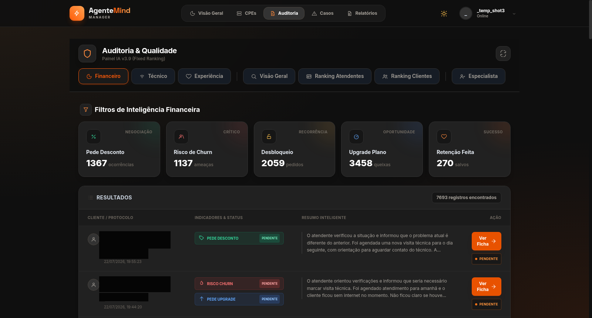
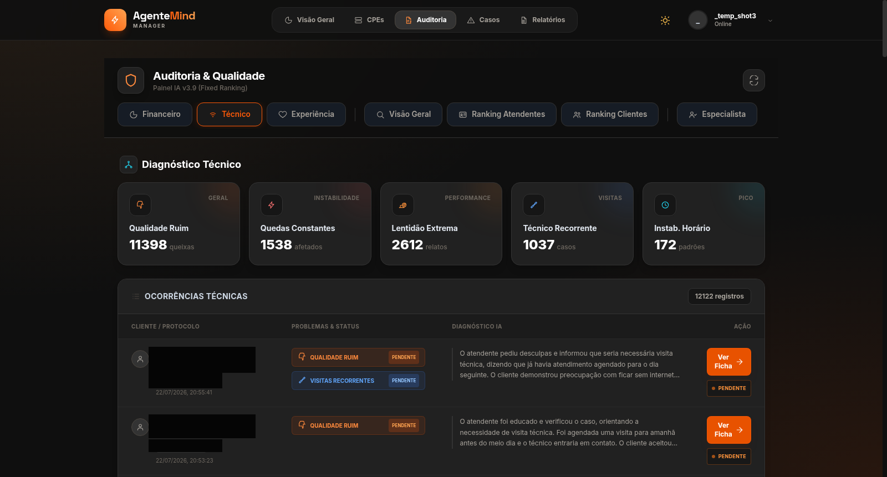
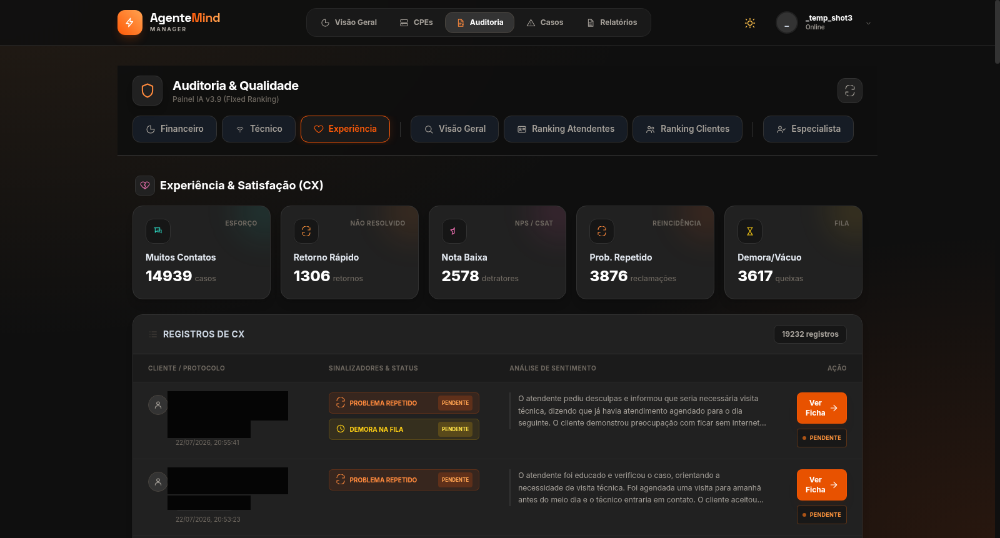
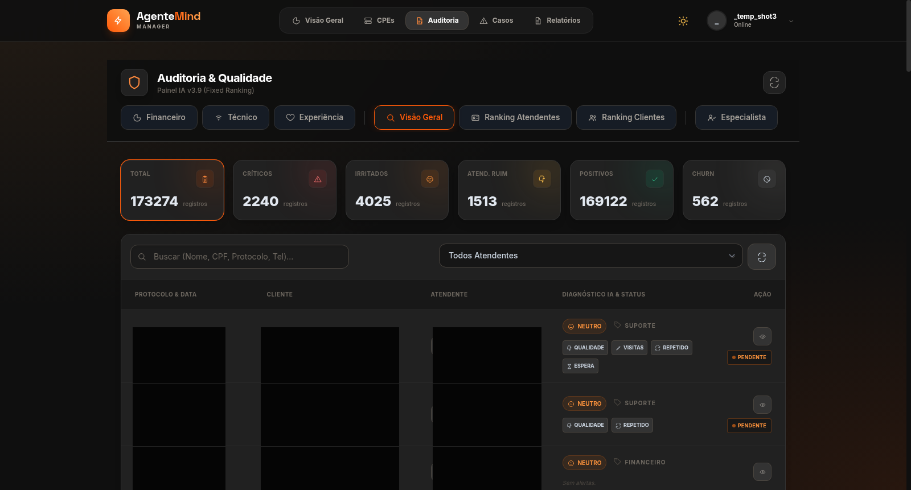
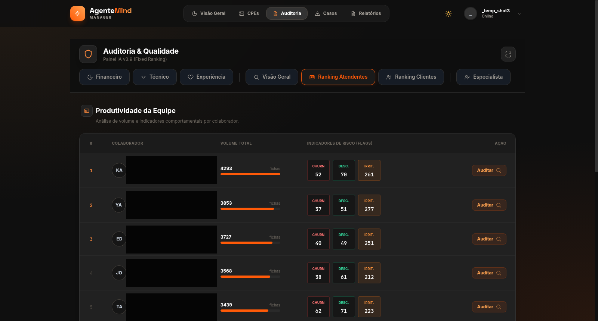
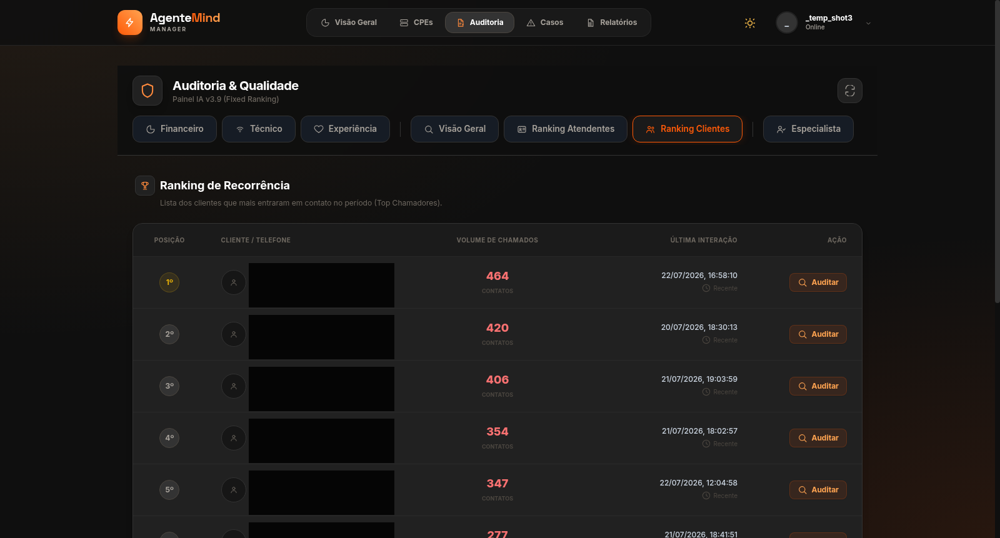
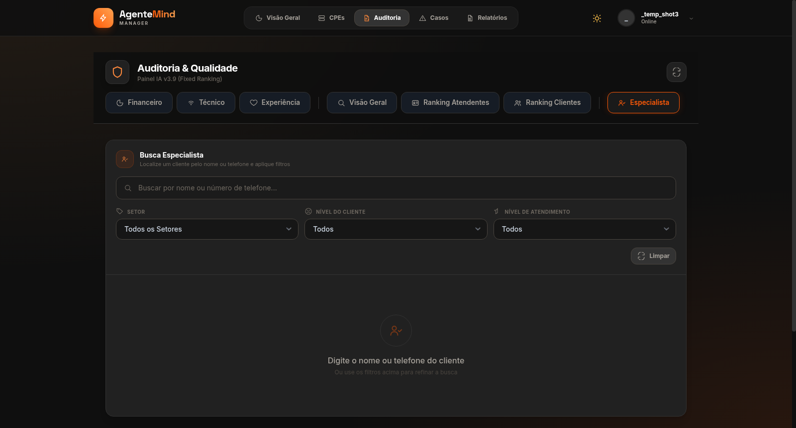
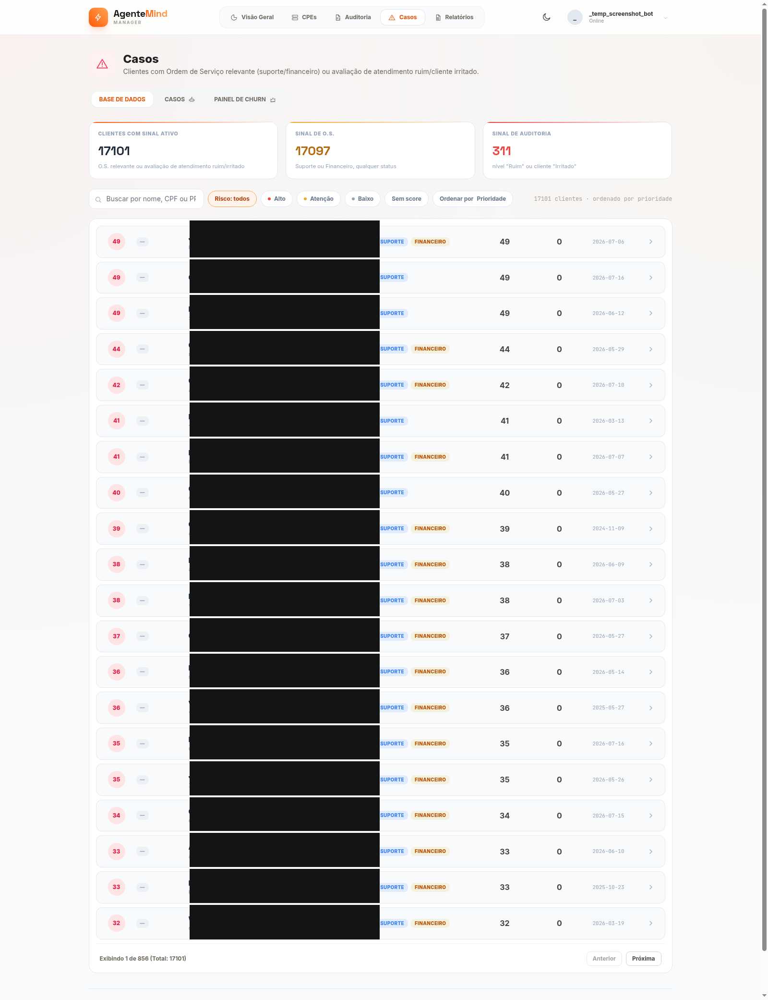
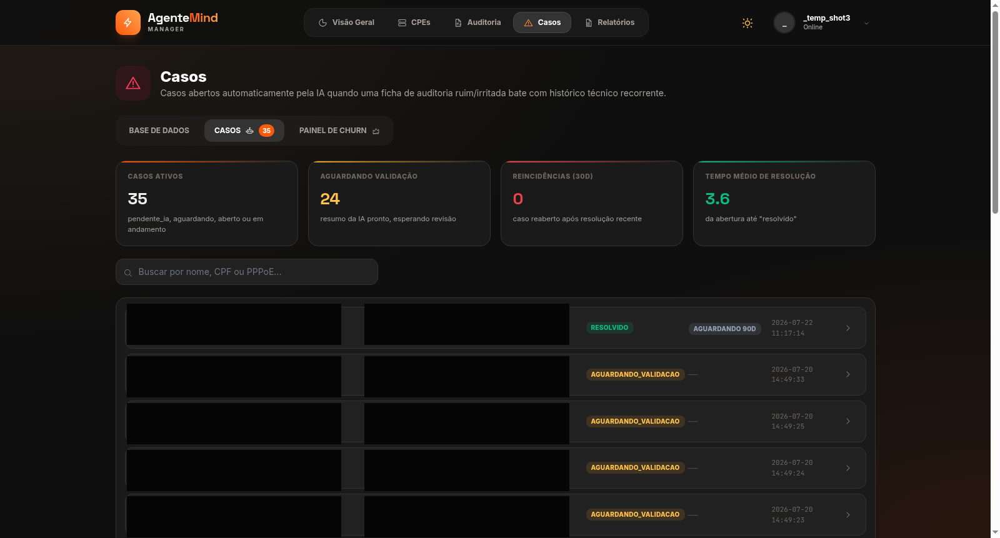
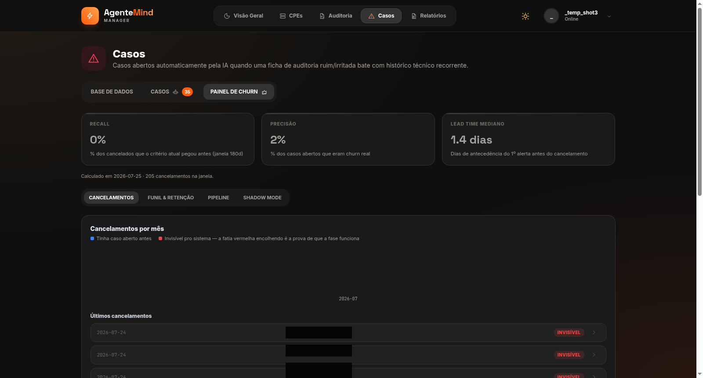

# Plataforma de Operação para ISP — Gestão de CPEs (TR-069) e Detecção de Risco de Cliente com IA

> Sistema **em produção ativa**, usado no dia a dia por uma equipe de NOC/suporte de um provedor de internet regional, atendendo clientes reais. Este repositório é uma apresentação do projeto para portfólio — mostra **o que o sistema faz e como está desenhado**, sem expor código-fonte, credenciais ou dados de clientes.

---

## O que é

Um painel único onde a equipe de suporte:

- Gerencia remotamente os roteadores/ONTs instalados na casa dos clientes (ligar/desligar Wi-Fi, trocar senha, reiniciar, atualizar firmware, diagnosticar sinal), sem precisar de visita técnica para a maioria dos casos.
- Acompanha em tempo real quais clientes estão online/offline e com que qualidade de sinal.
- Recebe alertas automáticos quando um cliente entra em padrão de risco (muitos chamados de suporte + atendimento com avaliação ruim), com um resumo gerado por IA já pronto pra quem for atender.

Por trás da tela, o sistema fala o protocolo de gerência remota de equipamentos de telecom (**TR-069/CWMP**) com milhares de dispositivos de diferentes fabricantes, cada um com seu próprio "dialeto" de parâmetros — e esconde essa complexidade do operador.

---

## Tour pelas telas

### 1. Dashboard geral
Visão consolidada da base: total de dispositivos online/offline, distribuição por fabricante/modelo, alertas recentes. É a tela de entrada de quem começa o turno.

### 2. Ficha do dispositivo
Ao abrir um cliente específico, o operador vê: status da conexão, sinal óptico, IP/PPPoE, redes Wi-Fi configuradas (e pode trocar nome/senha na hora), dispositivos conectados no momento, e ações rápidas (reiniciar, sincronizar, atualizar firmware). Praticamente todo atendimento de suporte técnico gira em torno dessa tela.

Ver as outras abas da ficha do dispositivo (WAN/Internet, Rede Local, Wireless)

**WAN/Internet** — credenciais PPPoE, status da conexão, VLAN, IPv6, consumo de banda:

**Rede Local** — endereçamento IP, servidor DHCP, DNS:

**Wireless** — rádios 2.4GHz/5GHz e até 8 redes Wi-Fi (SSIDs) configuráveis por dispositivo:

### 3. Diagnóstico remoto
Ferramentas de ping/traceroute/teste de velocidade disparadas a partir do próprio roteador do cliente (não do servidor), pra isolar se o problema é da rede do cliente, do link até a central, ou de algo externo.

### 4. Quarentena / monitoramento ativo
Motor que observa continuamente sinal e conectividade dos clientes e sinaliza automaticamente quem está com queda recorrente — antes que o cliente precise ligar reclamando. (Fila vazia no momento do print — sinal de que a base está saudável.)

### 5. Saúde do cliente
Um placar por cliente que combina qualidade de sinal, estabilidade da conexão e histórico de quarentena num único indicador — pra priorizar quem precisa de atenção proativa.

### 6. Auditoria de atendimento
Toda interação de suporte (chat/humano) é registrada e analisada por IA, sinalizando padrões como pedido de desconto, risco de churn ou insatisfação — com um resumo automático de cada atendimento.

Ver as outras abas da Auditoria (Técnico, Experiência, Visão Geral, Ranking de Atendentes, Ranking de Clientes, Especialista)

**Técnico** — diagnóstico de problemas técnicos recorrentes (qualidade, quedas, lentidão):

**Experiência** — satisfação do cliente (CX): esforço, NPS/CSAT, reincidência, tempo de fila:

**Visão Geral** — listagem consolidada de todos os atendimentos, com filtro por atendente e busca por nome/CPF/protocolo:

**Ranking de Atendentes** — produtividade e indicadores de risco (churn, desconto, irritação) por colaborador:

**Ranking de Clientes** — clientes que mais entram em contato no período (top chamadores recorrentes):

**Especialista** — busca dirigida de um cliente específico por nome/telefone com filtros de setor e nível:

### 7. Casos de risco
A parte mais avançada do sistema: cruza sinais de atendimento (avaliação ruim, cliente irritado) com histórico de chamados de suporte/financeiro pra priorizar quem precisa de atenção — de triagem ampla até casos formais abertos automaticamente quando os critérios batem juntos, com resumo gerado por IA.

Ver as outras abas de Casos (Casos IA, Painel de Churn)

**Casos (IA)** — casos formais abertos automaticamente, com resumo e diagnóstico gerado por IA, status de validação e reincidência:

**Painel de Churn** — métricas de eficácia do próprio motor de detecção (recall, precisão, lead time de antecedência) e lista de cancelamentos recentes, comparando quem tinha caso aberto antes de cancelar:

### 8. Teste de conexão do cliente
Link enviado ao cliente final (sem necessidade de login) que roda um teste de velocidade completo no navegador dele — não no roteador — pra medir a experiência real de internet do lado de quem usa.

---

## Desafios técnicos por trás das telas

Alguns problemas reais de escala e confiabilidade que precisaram ser diagnosticados e resolvidos ao longo da operação:

- **Fila de comandos entupida.** Uma rotina diária de sincronização em massa disparava, sem perceber, o comando mais caro possível (varrer a árvore inteira de parâmetros) em todo o parque de dispositivos. Em equipamentos com histórico de instabilidade, isso falhava e ficava acumulado pra sempre — o servidor de gerência não descarta comandos travados sozinho. O acúmulo chegou à casa das centenas de milhares. Resolvido trocando a varredura completa por atualizações pontuais só do necessário, mais uma limpeza automática de comandos parados.

- **Lentidão que só acontecia em alguns modelos.** O mesmo clique de "sincronizar" no painel demorava minutos em certos aparelhos e era instantâneo em outros. A causa era que o sistema, pra aqueles modelos, caía num caminho genérico e caro por falta de um mapeamento específico do fabricante. Resolvido mapeando corretamente cada modelo.

- **Indicador de sinal Wi-Fi enganoso.** Em uma linha de equipamentos, o campo do protocolo literalmente chamado "RSSI" não é o sinal real em dBm — é só um indicador de barras (0 a 5), e o dado de verdade está escondido em outro campo com nome diferente. Cada fabricante também formata esse dado de um jeito distinto. Resolvido com normalização por modelo, documentando qual campo é confiável em cada fabricante.

- **Contagem de dispositivos conectados que "travava".** A lista de aparelhos Wi-Fi conectados num roteador às vezes parava de atualizar o número de itens, mesmo com os dados individuais frescos — uma sutileza de como o protocolo de gerência distingue "atualizar um valor já conhecido" de "reconferir quantos itens existem". Resolvido ajustando essa configuração especificamente para tabelas de tamanho variável.

- **Trava de segurança contra falha em cascata.** Uma integração com o sistema de faturamento chegou a interpretar uma instabilidade temporária da API externa como "todos os contratos foram cancelados", e começou a apagar registros de milhares de clientes em produção antes de ser percebido e interrompido manualmente. A correção foi estrutural: a sincronização agora aborta sozinha se a API externa falhar parcialmente, e aborta também se detectar um volume de cancelamento incompatível com o normal — tratando isso como sinal de erro, não de fato real.

---

## Stack técnica

`PHP` · `MySQL` · `MongoDB` · `TR-069/CWMP (GenieACS)` · `OpenAI API` · `Alpine.js` · `cron / filas assíncronas`

---

*Sistema em produção ativa, atendendo clientes reais. Este repositório contém apenas material de apresentação para fins de portfólio — sem código-fonte, credenciais ou dados de clientes. Nas capturas de tela, dados sensíveis (nome de cliente, CPF/CNPJ, login) foram censurados antes da publicação.*
