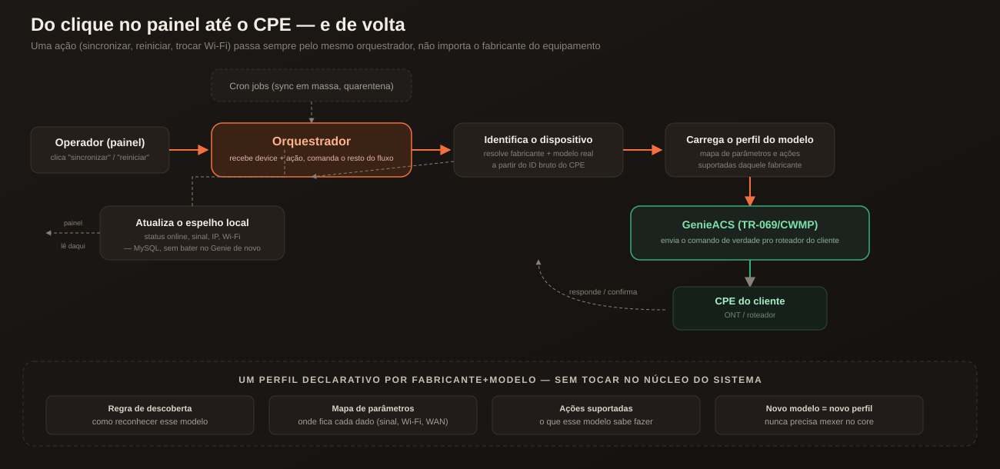
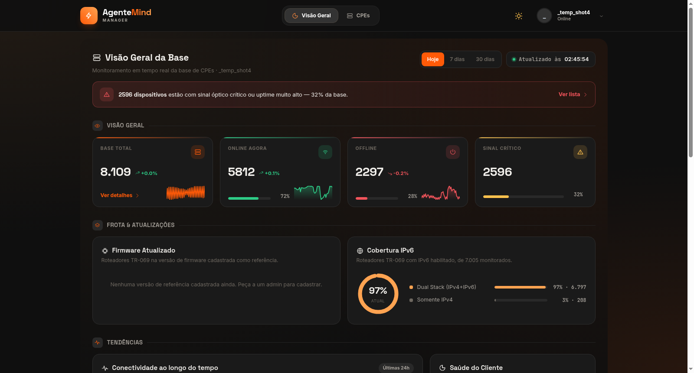
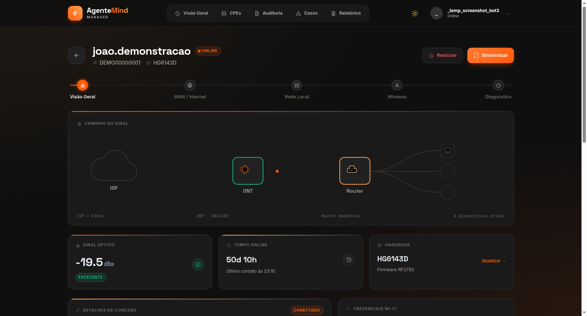
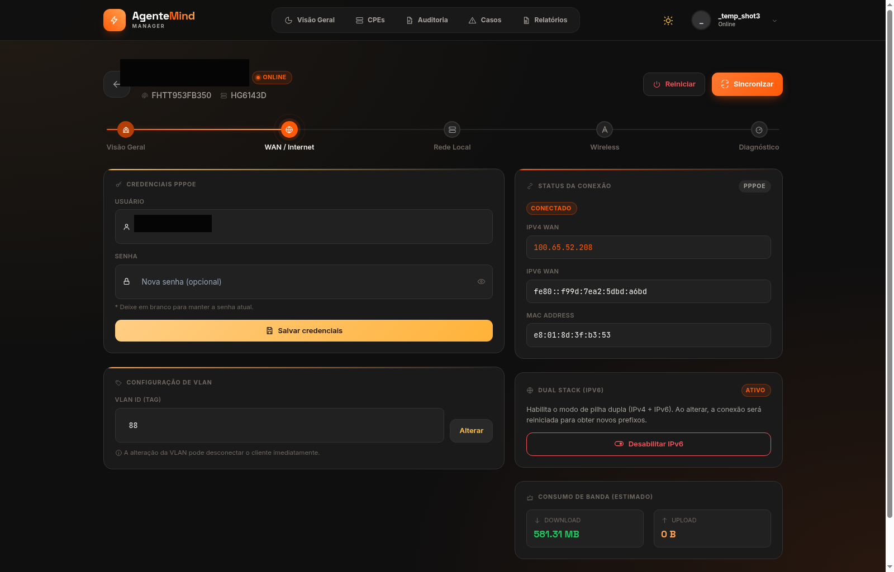
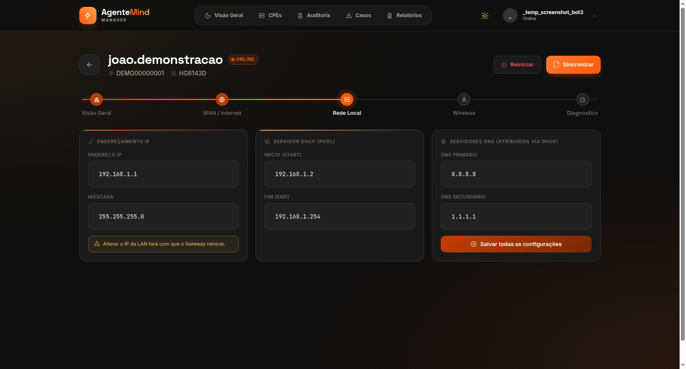
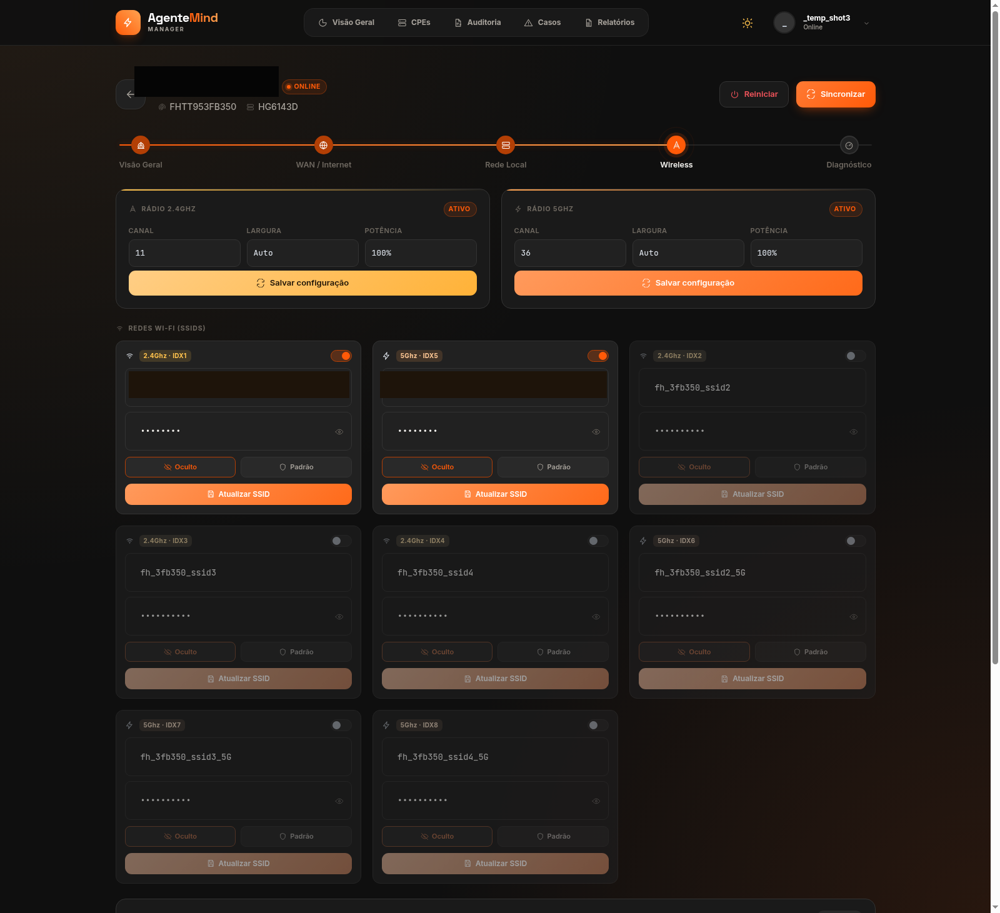
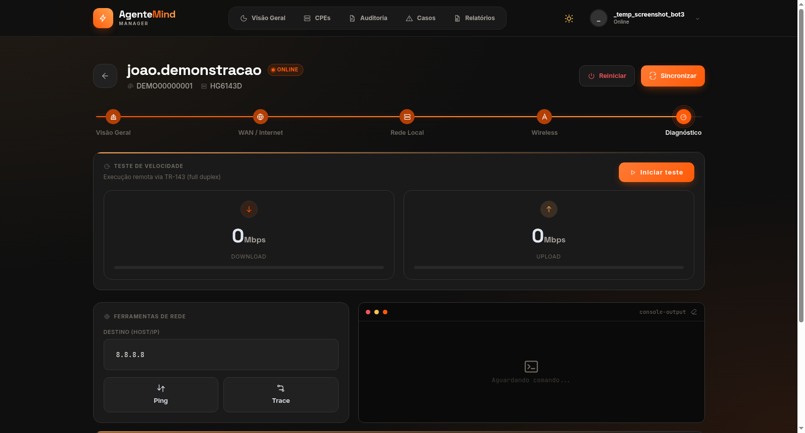
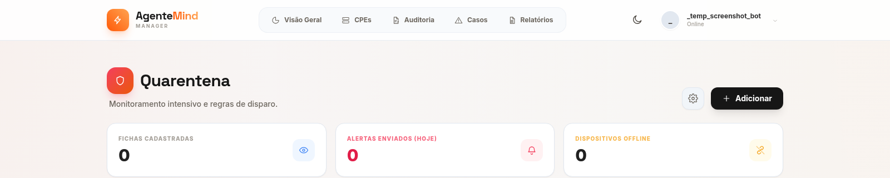
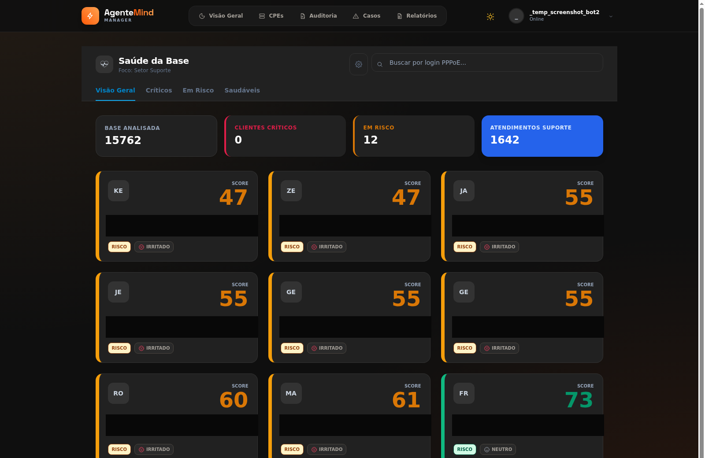

# ACS TR-069 — Painel de Gestão de CPEs para ISP

*[English version](README.en.md)*

> Sistema **em produção ativa**, usado no dia a dia por uma equipe de NOC/suporte de um provedor de internet regional, atendendo clientes reais. Este repositório é uma apresentação do projeto para portfólio — mostra **o que o sistema faz e como está desenhado**, sem expor código-fonte, credenciais ou dados de clientes.
>
> Projeto desenhado e desenvolvido individualmente — da arquitetura (TR-069/CWMP, espelho relacional) até a operação em produção.

## Índice

- [O que é](#o-que-é)
- [Como funciona, por trás da tela](#como-funciona-por-trás-da-tela)
- [Números da operação](#números-da-operação)
- [Tour pelas telas](#tour-pelas-telas)
- [Desafios técnicos por trás das telas](#desafios-técnicos-por-trás-das-telas)
- [Autor](#autor)

---

## O que é

Um painel único onde a equipe de suporte:

- Gerencia remotamente os roteadores/ONTs instalados na casa dos clientes (ligar/desligar Wi-Fi, trocar senha, reiniciar, atualizar firmware, diagnosticar sinal), sem precisar de visita técnica para a maioria dos casos.
- Acompanha em tempo real quais clientes estão online/offline e com que qualidade de sinal.
- Monitora ativamente sinal e conectividade, sinalizando automaticamente quem está com queda recorrente antes que o cliente precise ligar reclamando.

Por trás da tela, o sistema fala o protocolo de gerência remota de equipamentos de telecom (**TR-069/CWMP**) com milhares de dispositivos de diferentes fabricantes, cada um com seu próprio "dialeto" de parâmetros — e esconde essa complexidade do operador.

---

## Como funciona, por trás da tela

Sem entrar em código — toda ação (clicada no painel ou disparada por um cron) passa pelo mesmo caminho, coordenado por um **orquestrador** central:

1. **Disparo da ação** — vem do clique de um operador no painel (ex.: "sincronizar", "reiniciar") ou de um cron job (sincronização em massa, motor de quarentena).
2. **Orquestração** — um componente central recebe o dispositivo-alvo e a ação pedida, e comanda o resto do fluxo: descobrir quem é o dispositivo, carregar o comportamento certo pra ele, executar, e por fim atualizar o status — sem que o resto do sistema precise saber os detalhes de cada etapa.
3. **Identificação do dispositivo** — o ID que o servidor de gerência manda de volta nem sempre bate exatamente com o que está salvo (encodings diferentes, sufixos, formatos por fabricante). Essa etapa resolve **quem** é o dispositivo por trás do ID bruto.
4. **Carregamento do perfil** — cada combinação de fabricante+modelo tem um perfil próprio: onde fica cada dado relevante (sinal, Wi-Fi, WAN), e quais ações esse modelo específico sabe executar. Se não existir perfil dedicado, o sistema cai num comportamento genérico.
5. **Execução via TR-069/CWMP** — o comando de verdade sai daqui, através do servidor de gerência remota, até o roteador do cliente. É a única etapa que efetivamente conversa com o equipamento físico.
6. **Atualização do espelho local** — a resposta do dispositivo atualiza um banco relacional local (status, sinal, IP, Wi-Fi), pra o painel nunca precisar reconsultar a árvore inteira do dispositivo só pra mostrar uma tela.

Essa separação é o que permite adicionar suporte a um **novo modelo de CPE só criando um novo perfil** — sem tocar no núcleo do sistema.

---

## Números da operação

Dados reais extraídos das próprias capturas de tela abaixo (nada inflado para o portfólio):

| Métrica | Valor |
|---|---|
| CPEs monitorados em tempo real | ~8.100 |
| Dispositivos online no momento do print | ~5.800 (71% da base) |
| Dispositivos sinalizados com sinal crítico automaticamente | ~2.600 |
| Cobertura de dual stack IPv4+IPv6 na base monitorada | 97% |

---

## Tour pelas telas

### 1. Dashboard geral
Visão consolidada da base: total de dispositivos online/offline, distribuição por fabricante/modelo, alertas recentes. É a tela de entrada de quem começa o turno.

### 2. Ficha do dispositivo
Ao abrir um cliente específico, o operador vê: status da conexão, sinal óptico, IP/PPPoE, redes Wi-Fi configuradas (e pode trocar nome/senha na hora), dispositivos conectados no momento, e ações rápidas (reiniciar, sincronizar, atualizar firmware). Praticamente todo atendimento de suporte técnico gira em torno dessa tela.

Ver as outras abas da ficha do dispositivo (WAN/Internet, Rede Local, Wireless)

**WAN/Internet** — credenciais PPPoE, status da conexão, VLAN, IPv6, consumo de banda:

**Rede Local** — endereçamento IP, servidor DHCP, DNS:

**Wireless** — rádios 2.4GHz/5GHz e até 8 redes Wi-Fi (SSIDs) configuráveis por dispositivo:

### 3. Diagnóstico remoto
Ferramentas de ping/traceroute/teste de velocidade disparadas a partir do próprio roteador do cliente (não do servidor), pra isolar se o problema é da rede do cliente, do link até a central, ou de algo externo.

### 4. Quarentena / monitoramento ativo
Motor que observa continuamente sinal e conectividade dos clientes e sinaliza automaticamente quem está com queda recorrente — antes que o cliente precise ligar reclamando. (Fila vazia no momento do print — sinal de que a base está saudável.)

### 5. Saúde do cliente
Um placar por cliente que combina qualidade de sinal, estabilidade da conexão e histórico de quarentena num único indicador — pra priorizar quem precisa de atenção proativa.

### 6. Teste de conexão do cliente
Link enviado ao cliente final (sem necessidade de login) que roda um teste de velocidade completo no navegador dele — não no roteador — pra medir a experiência real de internet do lado de quem usa.

---

## Desafios técnicos por trás das telas

Alguns problemas reais de escala e confiabilidade que precisaram ser diagnosticados e resolvidos ao longo da operação:

- **Fila de comandos entupida.** Uma rotina diária de sincronização em massa disparava, sem perceber, o comando mais caro possível (varrer a árvore inteira de parâmetros) em todo o parque de dispositivos. Em equipamentos com histórico de instabilidade, isso falhava e ficava acumulado pra sempre — o servidor de gerência não descarta comandos travados sozinho. O acúmulo chegou à casa das centenas de milhares. Resolvido trocando a varredura completa por atualizações pontuais só do necessário, mais uma limpeza automática de comandos parados.

- **Lentidão que só acontecia em alguns modelos.** O mesmo clique de "sincronizar" no painel demorava minutos em certos aparelhos e era instantâneo em outros. A causa era que o sistema, pra aqueles modelos, caía num caminho genérico e caro por falta de um mapeamento específico do fabricante. Resolvido mapeando corretamente cada modelo.

- **Indicador de sinal Wi-Fi enganoso.** Em uma linha de equipamentos, o campo do protocolo literalmente chamado "RSSI" não é o sinal real em dBm — é só um indicador de barras (0 a 5), e o dado de verdade está escondido em outro campo com nome diferente. Cada fabricante também formata esse dado de um jeito distinto. Resolvido com normalização por modelo, documentando qual campo é confiável em cada fabricante.

- **Contagem de dispositivos conectados que "travava".** A lista de aparelhos Wi-Fi conectados num roteador às vezes parava de atualizar o número de itens, mesmo com os dados individuais frescos — uma sutileza de como o protocolo de gerência distingue "atualizar um valor já conhecido" de "reconferir quantos itens existem". Resolvido ajustando essa configuração especificamente para tabelas de tamanho variável.

- **Trava de segurança contra falha em cascata.** Uma integração com o sistema de faturamento chegou a interpretar uma instabilidade temporária da API externa como "todos os contratos foram cancelados", e começou a apagar registros de milhares de clientes em produção antes de ser percebido e interrompido manualmente. A correção foi estrutural: a sincronização agora aborta sozinha se a API externa falhar parcialmente, e aborta também se detectar um volume de cancelamento incompatível com o normal — tratando isso como sinal de erro, não de fato real.

---

## Autor

**Luan Castelhano** — [LinkedIn](https://www.linkedin.com/in/luan-castelhano-797372304/) · [GitHub](https://github.com/luanca3213)

---

*Sistema em produção ativa, atendendo clientes reais. Este repositório contém apenas material de apresentação para fins de portfólio — sem código-fonte, credenciais ou dados de clientes. Nas capturas de tela, dados sensíveis (nome de cliente, CPF/CNPJ, login) foram censurados antes da publicação.*
