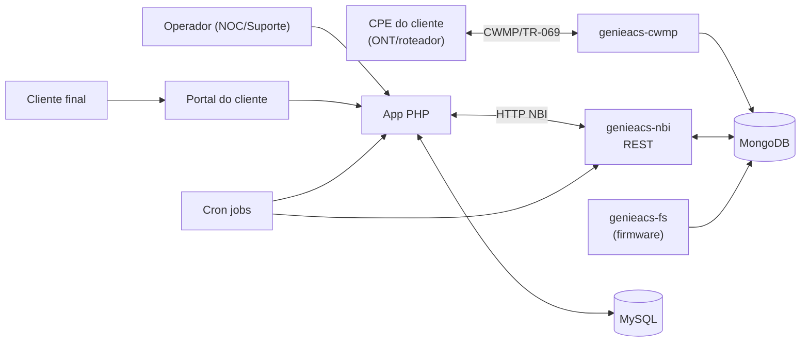

# ACS TR-069 — Painel de Gestão de CPEs para ISP

> Sistema **em produção ativa**, atendendo clientes reais de um provedor de internet regional — não é um projeto de estudo. Este repositório documenta a arquitetura e os problemas técnicos reais resolvidos ao longo da operação; o **código-fonte é proprietário e não está publicado aqui**.

## Contexto

Painel de gerência (**ACS — Auto Configuration Server**) para um provedor de internet (ISP) regional, com milhares de CPEs (ONTs/roteadores) de múltiplos fabricantes em campo. O sistema:

- Fala o protocolo **TR-069/CWMP** com os equipamentos dos clientes via **GenieACS**.
- Mantém um espelho relacional em **MySQL** para consultas rápidas do painel, sem bater na árvore TR-069 completa a cada carregamento de tela.
- Expõe uma interface web em **PHP** para operadores de NOC/suporte, e um portal separado para o cliente final.
- Roda um pipeline de detecção de risco de churn (auditoria de atendimento + IA) por cima da mesma base de clientes.

## Arquitetura



### Stack

- **Backend**: PHP (orientado a objetos, sem framework — camada própria de `Core`/`Services`/`Vendors`)
- **Protocolo de campo**: TR-069/CWMP via GenieACS (`genieacs-cwmp`, `genieacs-nbi`, `genieacs-fs`)
- **Bancos**: MongoDB (estado vivo por CPE, fonte de verdade do GenieACS) + MySQL (espelho relacional para o painel)
- **IA**: OpenAI API para triagem de atendimento e geração de resumos de casos de risco
- **Frontend**: Alpine.js + fetch sobre PHP server-rendered
- **Orquestração**: cron jobs + workers de fila em PHP puro

## Como o sistema resolve o problema

Um perfil por combinação **fabricante + modelo** de CPE define, de forma declarativa, o mapa de parâmetros TR-069 daquele equipamento (`parameters.json`), quais ações ele suporta (`capabilities.json`) e a regra de descoberta automática (`discovery.json`). Quando o genérico não é suficiente, uma classe PHP dedicada complementa o parsing (ex.: tabelas de host conectado, sinal óptico em path não padronizado).

```
Browser → API → Discovery::identify()      (acha fabricante/modelo real do CPE)
             → ProfileLoader::load()         (carrega o perfil certo, ou fallback genérico)
             → Profile::execute(ação)
               → GenieConnector             (task no GenieACS via NBI REST)
             → marca device online + last_seen
```

Isso permite plugar suporte a um novo modelo de CPE sem tocar no núcleo do sistema — só adicionando os arquivos de perfil (e, quando necessário, uma classe específica).

## Problemas de engenharia resolvidos (destaques)

**1. Backlog de centenas de milhares de tasks travadas no GenieACS**
O job diário de sincronização em massa disparava `refreshObject('')` (varredura da árvore TR-069 *inteira*) em todo o parque de dispositivos. Em CPEs com árvore grande/volátil isso falhava (`too_many_commits`/`session_terminated`) e, como o GenieACS não expira tasks travadas sozinho, o backlog crescia indefinidamente e competia por orçamento de sessão com dados que realmente importavam. Diagnóstico via log de acesso CWMP + inspeção direta do Mongo; correção em duas frentes: perfis por modelo passaram a atualizar só sub-objetos específicos em vez da árvore inteira, e um cron de limpeza passou a expirar tasks paradas há mais de 1h.

**2. Latência de sincronização manual (~2 min) específica por modelo**
Clicar "sincronizar" no painel para alguns modelos de CPE demorava muito mais que para outros, mesmo usando o mesmo fluxo. Causa raiz: paths de parâmetros TR-069 incorretos/genéricos para aquele fabricante faziam o sistema cair em fallback caro. Corrigido mapeando os paths reais por modelo e ajustando os *presets/provisions* do GenieACS (janelas de "freshness" diferentes para dado estático vs. dinâmico).

**3. Campos de sinal Wi-Fi enganosos entre fabricantes**
Em uma família de equipamentos, o campo TR-069 literalmente chamado `RSSI` **não é RSSI real** — é um indicador de barras (0–5). O valor real (dBm) está em outro campo (`SignalStrength`). Cada fabricante também expõe o dado num formato diferente (número puro, string com unidade embutida, campo ausente). Resolvido com normalização por perfil de modelo, documentando explicitamente qual campo usar/evitar em cada um.

**4. `declare({value})` ≠ `declare({object})` no GenieACS**
Tabelas de tamanho dinâmico (lista de clientes Wi-Fi conectados, por exemplo) ficavam com a *contagem de instâncias* congelada mesmo depois de ajustar a janela de atualização de valor. A causa era não declarar também a atualização do *objeto* (reenumeração da tabela), não só do valor — uma sutileza da API de provisioning do GenieACS que não é óbvia pela documentação.

**5. Guard-rail contra falha em massa de API externa**
Um pipeline de sincronização com o ERP do provedor interpretou um timeout da API externa como "todos os contratos foram cancelados" e chegou a apagar registros reais de milhares de roteadores antes de ser interrompido. Corrigido com duas salvaguardas: abortar a sincronização inteira se a API externa falhar em qualquer página de resultado, e abortar se mais de 10% da base for marcada como cancelada de uma vez — heurística simples para distinguir "cancelamento em massa real" de "API fora do ar".

**6. Pipeline de detecção de risco de cliente orientado a eventos**
Fila baseada em trigger de banco (`AFTER INSERT`) + tabela outbox + workers com *claim* atômico (`UPDATE ... WHERE processado=0 LIMIT N` com token único por execução) para avaliar, quase em tempo real, se um cliente cruzou critérios de risco (volume de chamados + sentimento do atendimento). Casos que batem os critérios são enriquecidos com histórico e resumidos por IA, com deduplicação para não abrir o mesmo caso duas vezes e detecção de reincidência.

## Módulos

| Módulo | Função |
|---|---|
| Núcleo TR-069 | Descoberta de fabricante/modelo, execução de ações (reboot, config de Wi-Fi/PPPoE/VLAN, firmware) por perfil |
| Sincronização | Cron jobs incrementais (leve, sem enfileirar comandos) + batch diário (mais caro, sob controle) |
| Quarentena / saúde do cliente | Motor de monitoramento ativo (sinal, ICMP) com histórico de falhas consecutivas e score agregado |
| Auditoria & Casos | Pipeline orientado a eventos que cruza atendimento + histórico de suporte e abre casos de risco de churn com resumo gerado por IA |
| Portal do cliente final | Acesso self-service por token, separado da sessão de operador |

---

*Sistema em produção ativa, atendendo clientes reais. Este repositório contém apenas documentação de arquitetura para fins de portfólio — sem código-fonte, credenciais ou dados de clientes.*
